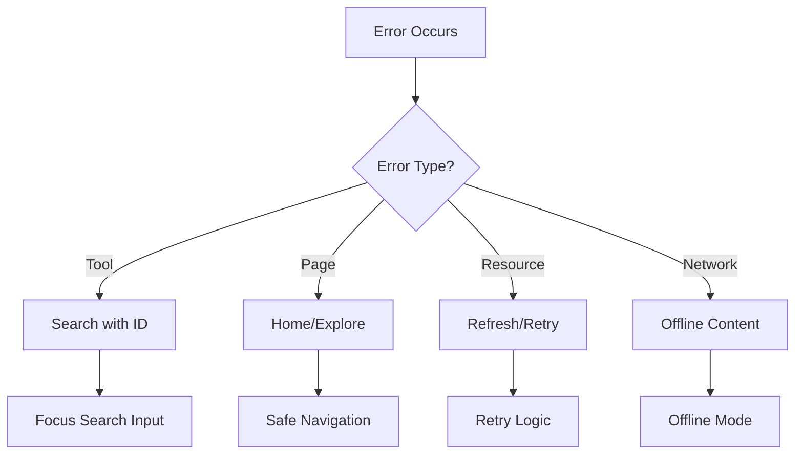

# Error State Components

This directory contains comprehensive error handling components for the AI Toologist application.

## NotFound Component

The `NotFound` component is a comprehensive error state handler that provides context-aware error messaging and intelligent navigation recovery.

### Features

#### Context-Aware Error Handling
- **Tool Errors**: Invalid or missing AI tool IDs
- **Page Errors**: 404 for missing pages or routes  
- **Resource Errors**: Unavailable files, images, or data
- **Network Errors**: Connection failures and timeouts

#### Navigation Intelligence
- **Smart Routing**: Context-aware navigation based on error type
- **Focus Management**: Auto-focuses search input when navigating to explore
- **Pre-filled Search**: Uses error ID as search query when applicable
- **Breadcrumb Recovery**: Intelligent back navigation to working areas

#### Accessibility (WCAG 2.1 AA Compliant)
- **Skip Links**: Screen reader navigation shortcuts
- **Focus Management**: Proper focus flow and keyboard navigation
- **ARIA Labels**: Descriptive labels and error announcements
- **Screen Reader Support**: Structured content hierarchy
- **Keyboard Navigation**: Tab, Enter, Esc key support

#### Design System Compliance
- **8-Point Grid**: Proper spacing (gap-6, p-6, mb-8, space-y-6)
- **Semantic Typography**: Uses h1, h2, h3, h4, p elements
- **Semantic Colors**: text-primary, text-muted-foreground, etc.
- **Responsive Design**: Mobile-first with proper breakpoints
- **Theme Support**: Light and dark mode compatibility

### Usage

```tsx
<NotFound 
  onNavigate={handleNavigation}
  currentScreen="current-page-id"
  selectedItem={{
    error: {
      type: 'tool',
      id: 'invalid-tool-id',
      message: 'Optional technical details',
      sourceUrl: 'Optional source URL',
      statusCode: 404
    }
  }}
/>
```

### Error Types

#### Tool Error
```tsx
{
  type: 'tool',
  id: 'chatgpt-invalid',
  message: 'Tool not found in database'
}
```
- Shows AI tool-specific messaging
- Provides search with pre-filled query
- Routes to explore with focus management

#### Page Error (Default)
```tsx
{
  type: 'page',
  statusCode: 404
}
```
- Generic 404 page messaging
- Routes to home or explore pages
- Shows popular sections

#### Resource Error
```tsx
{
  type: 'resource',
  id: 'file-name.pdf',
  message: 'File temporarily unavailable'
}
```
- Resource-specific error messaging
- Provides refresh option
- Shows alternative content

#### Network Error
```tsx
{
  type: 'network',
  statusCode: 503,
  message: 'Connection timeout'
}
```
- Network connectivity messaging  
- Retry functionality
- Offline content suggestions

### Navigation Actions

Each error type provides contextual navigation options:

1. **Primary Action**: Most relevant recovery option
2. **Secondary Action**: Alternative navigation
3. **Tertiary Action**: Safe fallback (usually home)
4. **Quick Back**: Browser back navigation

### Keyboard Shortcuts

- `Tab` - Navigate between elements
- `Enter` - Activate focused button
- `Esc` - Quick back navigation
- `Space` - Activate buttons

### Focus Management

The component automatically:
1. Focuses the primary action button on mount
2. Manages focus when navigating to other screens
3. Auto-focuses search input when routing to explore
4. Provides focus-visible styles for keyboard users

### Integration

The NotFound component integrates with:

- **App Router**: Global navigation system
- **ExploreFrame**: Focus management for search input
- **Tool Detail**: Invalid tool_id validation
- **Command Palette**: Global keyboard shortcuts

### Production Considerations

For production deployment:

1. **Database Validation**: Check tool_id against Supabase
2. **Analytics**: Log 404 events for tracking
3. **Error Boundaries**: React error boundary integration
4. **Network Handling**: Proper timeout and retry logic
5. **Search Suggestions**: AI-powered alternative suggestions
6. **Breadcrumb Context**: Enhanced navigation history

### Design Tokens

```css
/* Spacing follows 8-point grid */
.error-container { padding: 1.5rem; }  /* p-6 = 24px */
.error-sections { gap: 2rem; }         /* gap-8 = 32px */
.error-content { gap: 1.5rem; }        /* gap-6 = 24px */
.error-actions { gap: 1rem; }          /* gap-4 = 16px */

/* Colors use semantic tokens */
.error-title { color: var(--foreground); }
.error-description { color: var(--muted-foreground); }
.error-icon { color: var(--muted-foreground); }
```

### Testing

Test scenarios:
1. Invalid tool IDs from URL parameters
2. Direct access to non-existent routes  
3. Network timeout simulations
4. Resource unavailability
5. Keyboard-only navigation
6. Screen reader compatibility
7. Mobile responsive behavior

### Error Recovery Flow



This comprehensive error handling ensures users never hit dead ends and always have clear paths to recovery.